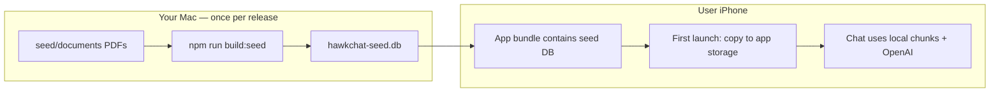

# HawkChat on the App Store (built-in documents)

This guide explains how to ship HawkChat with **documents already inside the app**—users open the app and chat immediately, no upload step.

## How it works



1. You put PDFs/text in `seed/documents/`.
2. `npm run build:seed` indexes them (OpenAI embeddings) into `seed/output/hawkchat-seed.db`.
3. The mobile app **copies** that database on first launch.
4. Chat **retrieves** from the local DB; answers still call **OpenAI** (internet required unless you add a local model later).

The current **Next.js web app cannot be submitted to the App Store as-is**. You need a **native shell** (recommended: **Capacitor**) plus a small amount of mobile-specific code to load the bundled database.

---

## Step 1 — Prepare built-in documents

```bash
# Add your files
cp /path/to/reports/*.pdf seed/documents/

# Build the seed database (needs OPENAI_API_KEY once)
npm run build:seed
```

Check output size: `seed/output/hawkchat-seed.db`. Large PDF sets can be 50–200MB+; App Store limit per app binary is **4GB**, but keep it reasonable for download size.

Edit `seed/manifest.json` to change the default notebook title:

```json
{
  "notebookId": "builtin-notebook",
  "notebookTitle": "Hawk-Eye Playbook 2026"
}
```

---

## Step 2 — Create the iOS app (Capacitor)

On your Mac with **Xcode** installed:

```bash
cd /Users/damian/Projects/HawkChat

# One-time: create the mobile wrapper (run from repo root)
npm install @capacitor/core @capacitor/cli @capacitor/ios
npx cap init "HawkChat" "com.hawkeye.hawkchat" --web-dir=out

# You will point web-dir at a mobile build; options:
# A) Hosted: web-dir = URL to your deployed site (documents only on server — not bundled)
# B) Bundled DB: custom Capacitor app that loads seed DB (recommended for your goal)
```

For **built-in documents**, plan a **dedicated mobile UI** (can reuse HawkChat React components later) that:

1. On first launch, copies `hawkchat-seed.db` from the app bundle into the device documents directory.
2. Opens SQLite read-only and runs the same RAG + chat logic (port `src/lib/rag.ts`, `chat.ts`, `chunking.ts`).
3. Calls OpenAI for chat completions (see Step 4 — do **not** ship your API key in the app).

Copy seed DB into the iOS project:

```bash
mkdir -p ios/App/App/public
cp seed/output/hawkchat-seed.db ios/App/App/public/
# Then add hawkchat-seed.db to Xcode target "Copy Bundle Resources"
```

---

## Step 3 — Apple Developer & Xcode

1. Enroll in [Apple Developer Program](https://developer.apple.com/programs/) ($99/year).
2. In Xcode: **Product → Archive → Distribute App → App Store Connect**.
3. In [App Store Connect](https://appstoreconnect.apple.com): create app, screenshots, description, privacy policy URL.
4. **Privacy nutrition labels**: disclose that user questions are sent to OpenAI for processing.
5. **Export compliance**: encryption (HTTPS) — usually standard exemption.

Review time is often 1–3 days; rejections are common on first submit (metadata, privacy, login flows).

---

## Step 4 — OpenAI API key (critical for App Store)

**Do not embed `OPENAI_API_KEY` in the iOS app.** Anyone can extract it from the IPA.

| Approach | App Store safe? | Notes |
|----------|-----------------|-------|
| Key in app binary | No | Rejected / abused |
| User enters own key in Settings | OK | Poor UX for 100 users |
| **Your backend proxy** | Yes | App calls `https://api.yourcompany.com/chat`; server holds the key |

Recommended: deploy a thin API (can be the existing HawkChat server) that:

- Accepts chat requests only (no upload needed if DB is on device)
- Rate-limits per device or auth token
- Holds `OPENAI_API_KEY` server-side

For **fully on-device** chat with bundled docs, you’d later swap OpenAI for a local model (large extra project).

---

## Step 5 — Android (Google Play)

Same seed DB:

```bash
npm install @capacitor/android
npx cap add android
cp seed/output/hawkchat-seed.db android/app/src/main/assets/
```

Play Console: one-time $25 registration, similar privacy disclosures.

---

## What stays on the web app vs mobile app

| Feature | Web (current) | App Store app |
|---------|---------------|---------------|
| Built-in PDFs | Manual upload | **Pre-bundled** `hawkchat-seed.db` |
| User upload | Yes | Optional / omit for simpler v1 |
| Admin / 100 users | Server auth | Optional; v1 can be single-notebook, no login |
| Chat | OpenAI | OpenAI via **your proxy** |
| Updates to docs | Re-upload | **New app version** + new seed build |

To update documents: add files → `npm run build:seed` → bump app version → resubmit to App Store.

---

## Checklist before submit

- [ ] `npm run build:seed` succeeds with production documents
- [ ] Seed DB copied into iOS/Android bundle
- [ ] First-launch copy + open SQLite tested on a real device
- [ ] Chat works via backend proxy (no API key in app)
- [ ] Privacy policy published (website URL)
- [ ] App icon, screenshots, description
- [ ] TestFlight beta with 10+ users

---

## Next implementation in this repo

If you want to proceed, the next code tasks are:

1. **Capacitor `mobile/` app** with bundled seed DB loader  
2. **Minimal chat API** on your server for mobile-only clients  
3. **Optional**: read-only mode (no upload UI) for v1 App Store build  

Say if you want **iOS first** or **iOS + Android together**, and whether chat should go through **your server** or **user-supplied API keys**.
